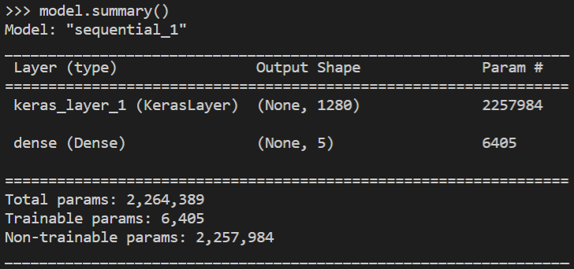
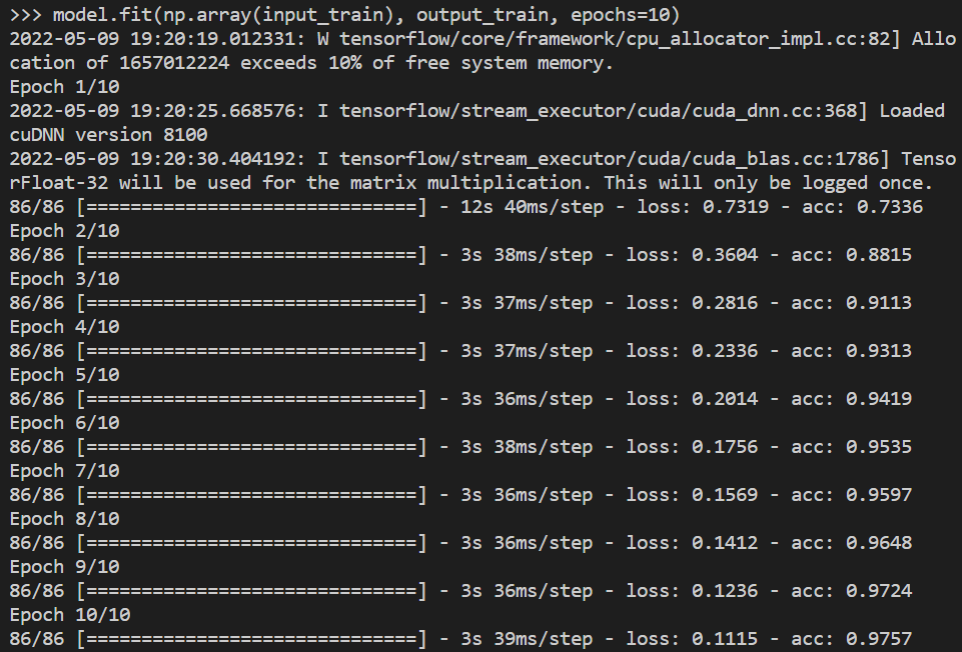
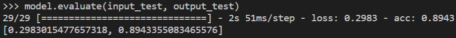

# Experimental results

The model trained to classify flowers was composed of the [feature vector](https://tfhub.dev/google/tf2-preview/mobilenet_v2/feature_vector/4) from the MobileNet v2 machine learning model, and a trainable output layer consisting of 5 neurons. The training was done on a system with 16GB of ram and a NVIDIA RTX 3060 Laptop GPU.

Below is a summary of the model:

The 6,405 trainable parameters represent the weights and biases of the 5 neurons in the output layer, whereas the 2,257,984 non-trainable parameters are the weights and biases of the feature vector, which will remain fixed during the training process.

The model was compiled using an Adam optimizer and a SparseCategoricalCrossentropy loss function. The duration of the training was 10 epochs, in which the following results were achieved for the input training dataset:

The model progressively improved its accuracy over the duration of the 10 epochs, eventually reaching an accuracy of over 97%. This is a very promising result.

The model was also evaluated on a testing dataset, which produced the following result:

The performace was still great overall, and the result also shows that the model is not overfitting.

### Conclusion

The model performed reasonably well over the training duration of just 10 epochs. The accuracy obtained and the resource usage show that a transfer learning approach is definitely a viable option when training a model with limited resources.